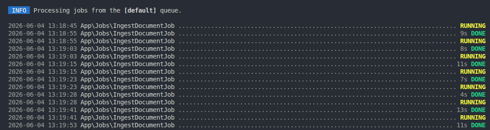

<!-- #region Title -->

# Laravel AI Knowledge Base (RAG)

This project demonstrates the implementation of a complete Retrieval-Augmented Generation (RAG) pipeline, including document ingestion, text chunking, embedding generation, vector similarity search, asynchronous processing with Laravel Queues, and LLM-powered answer generation.

The application ingests PDF and TXT documents, generates vector embeddings, stores them in a relational database, and performs semantic retrieval to provide context-aware AI responses grounded in the retrieved content.

---

<!-- #endregion -->

<!-- #region Badges -->


---

<!-- #endregion -->

<!-- #region TechStack -->

## 💻 Tech Stack

- PHP 8.2+
- Laravel 11
- MySQL 8.x
- Laravel Queues
- Groq (llama-3.3-70b-versatile)
- Jina AI (jina-embeddings-v2-base-en)
- smalot/pdfparser

---

<!-- #endregion -->

<!-- #region KeyFeatures -->

## 🚀 Key Features

* **Asynchronous Ingestion Pipeline:** Uses Laravel Queues to parse files (`.txt`, `.pdf`) and generate vector embeddings without blocking the application.
* **Semantic Vector Search:** Implements a pure PHP/MySQL Cosine Similarity algorithm to find the most relevant context for any user query.
* **Context-Driven AI Chat:** Leverages Groq (`llama-3.3-70b-versatile`) and Jina AI (`jina-embeddings-v2-base-en`) to generate responses grounded in retrieved contextual information, significantly reducing hallucinations.
* **Clean Architecture:** Fully decoupled components utilizing Interfaces, Factories, Jobs, and dedicated Service layers.

---

<!-- #endregion -->

<!-- #region Architecture -->

## 🛠️ Architecture & Workflow

### 1. Ingestion (`/api/ai-db-embedding`)

- Scans the `storage/app/rag-data` directory
- Dispatches queued jobs
- Extracts text using specialized parsers
- Segments content into overlapping chunks
- Requests embeddings from Jina AI
- Persists chunks and embeddings into MySQL

### 2. Retrieval & Generation (`/api/ai-chat`)

- Generates an embedding for the user's question
- Executes Cosine Similarity search across stored embeddings
- Retrieves the top 3 most relevant chunks
- Injects the retrieved context into the system prompt
- Requests a grounded response from Groq

### End-to-End Data Flow

```text
TXT/PDF
  │
  ▼
Parser
  │
  ▼
Chunking
  │
  ▼
Jina AI
  │
  ▼
MySQL
  │
  ▼
Similarity Search
  │
  ▼
Groq
  │
  ▼
Response
```

---

<!-- #endregion -->

<!-- #region CoreComponent -->

## 📦 Core Component Breakdown

### 1. Document Processing Pipeline

Documents (PDF/TXT) are parsed using a Factory-based architecture that resolves the correct parser based on file type.

This ensures extensibility for future formats without modifying core logic.

### 2. Smart Text Chunking

The ChunkingService uses a sliding-window strategy with overlap to preserve context between segments and improve retrieval quality.

### 3. Embedding Generation

Text chunks are converted into high-dimensional vector embeddings using Jina AI (jina-embeddings-v2-base-en), enabling semantic search over raw text.

### 4. Vector Similarity Search

Cosine Similarity:

`Similarity = (A · B) / (||A|| × ||B||)`

A custom implementation of cosine similarity is used to compare query embeddings against stored vectors in MySQL.

### 5. End-to-End RAG Flow

Document ingestion → Parsing → Chunking → Embedding → Storage → Retrieval → LLM Response

---

<!-- #endregion -->

<!-- #region DesignDecision -->

## 🎯 Design Decisions

### Why Laravel?

This project was intentionally built with Laravel to demonstrate that modern AI-powered applications can be implemented using traditional web frameworks and software engineering practices.

The focus is not only on AI integration, but also on maintainability, scalability, testing, and clean architecture.

### Why MySQL Instead of a Vector Database?

Embeddings are stored in MySQL using a standard JSON column rather than an external vector database such as Pinecone or Weaviate.

This approach keeps the project self-contained, simplifies local development, and demonstrates the underlying mechanics of vector search without introducing additional infrastructure dependencies.

For larger-scale production environments, the architecture can be extended to dedicated vector databases with minimal changes to the ingestion and retrieval pipeline.

### Why Queue Processing?

Document parsing and embedding generation are the most computationally expensive operations in the system.

By processing these tasks asynchronously through Laravel Queues, HTTP requests remain responsive while ingestion workloads are handled in the background.

This design mirrors how production systems typically process large document collections.

### Why a Factory-Based Parser Architecture?

Different document types require different parsing strategies.

Using a Factory pattern allows new file formats to be supported without modifying the ingestion workflow, keeping the system extensible and compliant with the Open/Closed Principle.

---

<!-- #endregion -->

<!-- #region DatabaseStructure -->

## 💾 Database Infrastructure & Scale Notes

The current implementation stores embeddings in a standard `JSON` column to maximize compatibility across MySQL 8.x environments and keep the project self-contained.

For larger-scale workloads, the architecture can be adapted to use native vector data types and vector indexing capabilities as they become available in database engines and managed vector databases.

This allows the ingestion and retrieval pipeline to evolve without requiring major architectural changes.

---

<!-- #endregion -->

<!-- #region InstallationSetup -->

## ⚡ Installation & Setup

### Prerequisites

- PHP 8.2+
- Composer 2.x
- MySQL 8.x
- Jina AI API Key
- Groq API Key
- Laravel Queue Driver (database or redis)

### 1. Clone the repository

```bash
git clone git@github.com:limanetolimaneto/Laravel-RAG.git
cd laravel-rag
```

### 2. Install dependencies

```bash
composer install
```

### 3. Configure environment variables

Copy the example file:

```bash
cp .env.example .env
```

Then configure:

```bash
DB_CONNECTION=mysql
DB_HOST=127.0.0.1
DB_PORT=3306
DB_DATABASE=rag
DB_USERNAME=root
DB_PASSWORD=
QUEUE_CONNECTION=database
JINA_API_KEY=your_jina_ai_key_here
GROQ_API_KEY=your_groq_api_key_here
```

### 4. Generate application key

```bash
php artisan key:generate
```

### 5. Run database migrations

```bash
php artisan migrate
```

### 6. Start queue worker

```bash
php artisan queue:work
```
> **Important:** The queue worker must be running before triggering document ingestion; otherwise, parsing and embedding jobs will remain pending.

### 7. Start the application

```bash
php artisan serve
```


---

<!-- #endregion -->

<!-- #region Endpoints -->

## 🛰️ API Endpoints

| Method | Endpoint | Description |
|----------|----------|-------------|
| POST | `/api/ai-db-embedding` | Scans directory, triggers parsers and dispatches embedding jobs. |
| POST | `/api/ai-search` | Returns the most relevant chunks based on cosine similarity. |
| POST | `/api/ai-chat` | Executes the complete RAG workflow and generates an AI response. |

---

<!-- #endregion -->

<!-- #region UsageExamples -->

## 🔍 Usage Examples

### 1. Ingest Data:

```bash
curl -X POST http://localhost:8000/api/ai-db-embedding
```

Response
```json
{
  "message": "Jobs dispatched successfully"
}
```

### 2. Test Vector Similarity Search

```bash
curl -X POST http://localhost:8000/api/ai-search \
-H "Content-Type: application/json" \
-d '{ "question": "What is Laravel?" }'
```
Response
```json
{
  "message": "response"
}
```

### 3. Ask a Question (Full RAG Workflow)
```bash
curl -X POST http://localhost:8000/api/ai-chat \
-H "Content-Type: application/json" \
-d '{ "question": "What is Clean Architecture?" }'
```
Response
```json
{
  "message": "response"
}
```


---
<!-- #endregion -->

<!-- #region ProjectStructure -->

## 📂 Project Structure

```text
app/
├── Contracts/
│   └── Interfaces and abstractions
│
├── Factories/
│   └── Parser resolution
│
├── Jobs/
│   └── Asynchronous document processing
│
├── Parsers/
│   ├── PdfParser
│   └── TxtParser
│
├── Services/
│   ├── ChunkingService
│   ├── EmbeddingService
│   ├── SimilarityService
│   └── ChatService
│
├── Http/
│   └── Controllers/
│
└── Models/

storage/
└── app/
    └── rag-data/
```

---

<!-- #endregion -->

<!-- #region SampleDataset -->

## 📚 Sample Dataset

The `storage/app/rag-data` directory contains sample TXT and PDF documents used as the project's knowledge base.

During ingestion, these documents are parsed, chunked, transformed into vector embeddings, and stored for semantic retrieval.

---

<!-- #endregion -->

<!-- #region License -->

## 📄 License

This project is licensed under the MIT License.

---

<!-- #endregion -->

<!-- #region ScreenShots -->

## 📸 Screenshots

### Document Ingestion

The ingestion endpoint scans the knowledge base directory, dispatches queue jobs, parses documents, and generates vector embeddings.




### Semantic Search


The search endpoint converts the user's question into an embedding and retrieves the most relevant chunks using cosine similarity.

### AI Chat Response


The retrieved context is injected into the prompt, allowing the LLM to generate grounded responses based on the indexed documents.


<!-- #endregion -->

<!-- #region Improvements -->

## 🚀 Future Improvements

* Native vector support using database vector data types and indexes.
* Approximate Nearest Neighbor (ANN) search for large-scale datasets.
* Hybrid retrieval combining semantic and keyword search.
* Support for additional document formats (DOCX, Markdown, HTML).
* Streaming AI responses.
* Multi-user document collections.

<!-- #endregion -->


